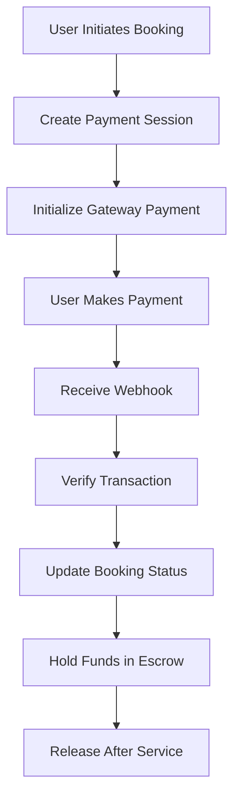

# Payment Integration Documentation

## Overview
UnibenServices implements a multi-provider payment system using Paystack and Flutterwave, with built-in fallback mechanisms and split payments for marketplace transactions.

## Payment Flow

### Standard Payment Flow
1. Initialize payment
2. Redirect to payment gateway
3. Process webhook notification
4. Verify transaction
5. Update booking status
6. Release funds (after service completion)



## Implementation

### Payment Provider Interface
```typescript
interface PaymentProvider {
  initialize(params: PaymentInitParams): Promise<PaymentSession>
  verify(reference: string): Promise<TransactionStatus>
  refund(transactionId: string, amount: number): Promise<RefundStatus>
  split(params: SplitPaymentParams): Promise<void>
}
```

### Payment Configuration
```typescript
// packages/payments/src/config.ts
export const paymentConfig = {
  paystack: {
    secretKey: process.env.PAYSTACK_SECRET_KEY,
    publicKey: process.env.PAYSTACK_PUBLIC_KEY,
    merchantEmail: process.env.PAYSTACK_MERCHANT_EMAIL,
    splitCode: process.env.PAYSTACK_SPLIT_CODE,
  },
  flutterwave: {
    secretKey: process.env.FLUTTERWAVE_SECRET_KEY,
    publicKey: process.env.FLUTTERWAVE_PUBLIC_KEY,
    encryptionKey: process.env.FLUTTERWAVE_ENCRYPTION_KEY,
  },
}
```

## Split Payment Configuration

### Service Provider Setup
```typescript
interface ProviderPayoutAccount {
  bankCode: string
  accountNumber: string
  bankName: string
  accountName: string
  subaccountCode?: string
}
```

### Revenue Sharing Model
- Platform Fee: 10%
- Provider Share: 90%
- Transaction Fees: Absorbed by platform

## Webhook Handling

### Endpoint Security
```typescript
// packages/payments/src/webhooks.ts
export async function verifyWebhookSignature(
  signature: string,
  payload: unknown
): Promise<boolean> {
  // Implementation
}
```

### Transaction Processing
```typescript
export async function handlePaymentWebhook(
  provider: PaymentProvider,
  payload: WebhookPayload
): Promise<void> {
  // Verify signature
  // Process transaction
  // Update booking status
  // Handle escrow
}
```

## Error Handling

### Common Payment Errors
1. Insufficient funds
2. Card declined
3. Network issues
4. Validation errors

### Error Recovery
```typescript
export async function retryFailedTransaction(
  transactionId: string,
  maxAttempts = 3
): Promise<boolean> {
  // Implementation
}
```

## Testing

### Test Cards
```typescript
export const testCards = {
  success: {
    number: '4084084084084081',
    cvv: '408',
    expiry: '01/25',
  },
  failure: {
    number: '4084084084084082',
    cvv: '408',
    expiry: '01/25',
  },
}
```

## Security Best Practices

### Data Protection
1. Never log full card details
2. Encrypt sensitive data
3. Use tokenization
4. Implement request signing

### Fraud Prevention
1. Implement velocity checks
2. Monitor suspicious patterns
3. Set transaction limits
4. Verify user identity

## Monitoring & Analytics

### Key Metrics
1. Transaction success rate
2. Payment gateway uptime
3. Average transaction time
4. Error frequency
5. Revenue analytics

### Logging
```typescript
export async function logPaymentActivity(
  activity: PaymentActivity
): Promise<void> {
  // Implementation
}
```

## Reconciliation

### Daily Settlement
```typescript
export async function reconcileTransactions(
  date: Date
): Promise<ReconciliationReport> {
  // Implementation
}
```

## API Reference

### Initialize Payment
```typescript
POST /api/payments/initialize
{
  "amount": number,
  "bookingId": string,
  "provider": "PAYSTACK" | "FLUTTERWAVE"
}
```

### Verify Transaction
```typescript
GET /api/payments/verify/:reference
```

### Refund Payment
```typescript
POST /api/payments/refund
{
  "transactionId": string,
  "amount": number,
  "reason": string
}
```

## Deployment Checklist
1. Configure webhook URLs
2. Set up split payment rules
3. Enable transaction notifications
4. Configure payout schedules
5. Set up monitoring alerts
6. Test webhooks in production
7. Verify SSL certificates
