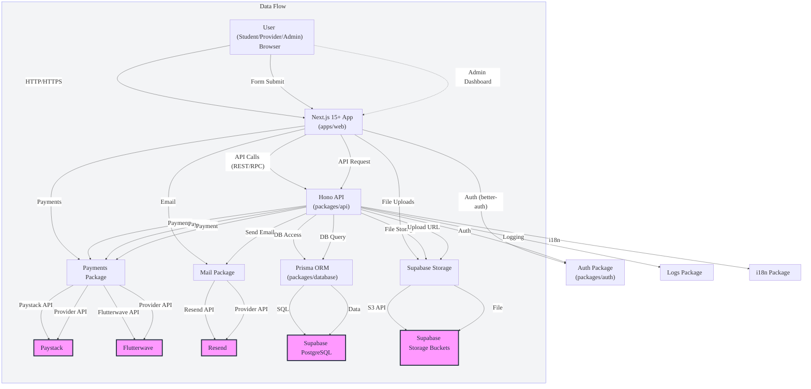

# UnibenServices Architecture & Data Flow

---

**Legend:**
- **A**: User interacts with the frontend (Next.js app)
- **B**: Next.js app handles UI, calls APIs, manages auth, uploads, payments
- **C**: Hono API layer (REST/RPC endpoints)
- **D**: Authentication (better-auth)
- **E**: Supabase Storage (for files/images)
- **F**: Payments logic (Paystack/Flutterwave)
- **G**: Email logic (Resend)
- **H**: Prisma ORM (DB access)
- **I**: Logging
- **J**: i18n
- **N**: Supabase PostgreSQL (main DB)
- **O**: Supabase Storage Buckets
- **K/L**: Payment Providers
- **M**: Email Provider

This diagram shows the main data flow from the frontend, through the API, to the database, storage, payments, and email providers. Each package is modularized for separation of concerns and scalability.
